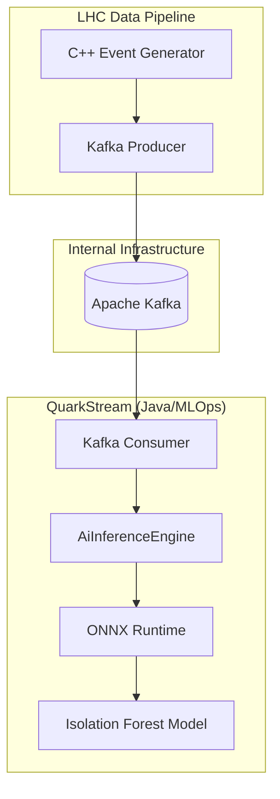

# QuarkStream: Distributed AI Anomaly Detection Service


A real-time MLOps pipeline designed to demonstrate high-throughput physics data processing using enterprise-grade infrastructure. Built as part of a technical portfolio for CERN studentship applications.

## Overview

QuarkStream is a distributed MLOps backend that consumes live physics telemetry from the [LHC-data-pipeline](https://github.com/Divij-Bhoj/LHC-data-pipeline) (the Event Generator). It performs real-time anomaly detection using a multi-feature **Isolation Forest** model running on the **ONNX Runtime**, demonstrating a production-ready AI inference chain.

This project represents the **"Filtering Brain"** in a larger experimental software ecosystem, mimicking how real LHC experiments (like CMS or ATLAS) use High-Level Triggers (HLT) to filter millions of collisions.

## Architecture



1. **Ingestion:** Consumes `lhc-raw-events` from a Kafka topic.
2. **Analysis:** Passes event payloads to an `AiInferenceEngine`.
3. **Inference:** Uses an AI model to detect anomalies in physics telemetry.

4. **Alerting:** Logs detected anomalies with high precision scoring.

## CI/CD Pipeline

The project includes a robust GitHub Actions workflow (`.github/workflows/ci.yml`) that:
- Automatically builds the project with Gradle.
- Executes unit tests for the AI inference logic.
- Ensures the stability of the distributed system on every commit.

## Sample Execution Logs

When the service is running, the AI engine processes high-speed telemetry and identifies anomalous physics signatures (e.g., high Transverse Momentum events):

```text
2026-02-28 12:31:42 INFO  c.e.demo.QuarkStreamApplication : Started QuarkStreamApplication
2026-02-28 12:31:47 INFO  o.s.k.l.KafkaMessageListenerContainer : mlops-anomaly-detector: partitions assigned
2026-02-28 12:32:33 INFO  c.e.demo.LhcEventConsumer : Received physics event: {"event_id": 1772281953, "pt": 42.5, ...}
2026-02-28 12:35:17 WARN  c.e.demo.AiInferenceEngine : 🚨 ANOMALY_DETECTED: High-Transverse Momentum Signal (pt=1500.2 GeV)
```

## MLOps Control Room [Dashboard]

The project includes a premium real-time visualization dashboard. Once the service is running, navigate to:
**`http://localhost:8085`**

This dashboard provides a "Live Telemetry" view, showing real-time event counts and visual alerts for AI-detected anomalies.

## Containerization & Orchestration

- **Docker:** `Dockerfile` provided for standard OCI containerization.
- **Docker Compose:** Orchestrates the full stack (Zookeeper + Kafka + QuarkStream).
- **Kubernetes:** `k8s/deployment.yaml` included for resilient, scalable deployment.

## Getting Started

### Prerequisites
- Java 17+
- Docker & Docker Compose
- A running Kafka instance (port 9092)

### Running Pure Infrastructure (Docker)

The recommended way to run the full stack is via Docker Compose:

```bash
sudo docker compose up --build
```

### Manual Development

If you wish to run the Java application manually:

```bash
./gradlew build
java -jar build/libs/QuarkStream-0.0.1-SNAPSHOT.jar
```

---
